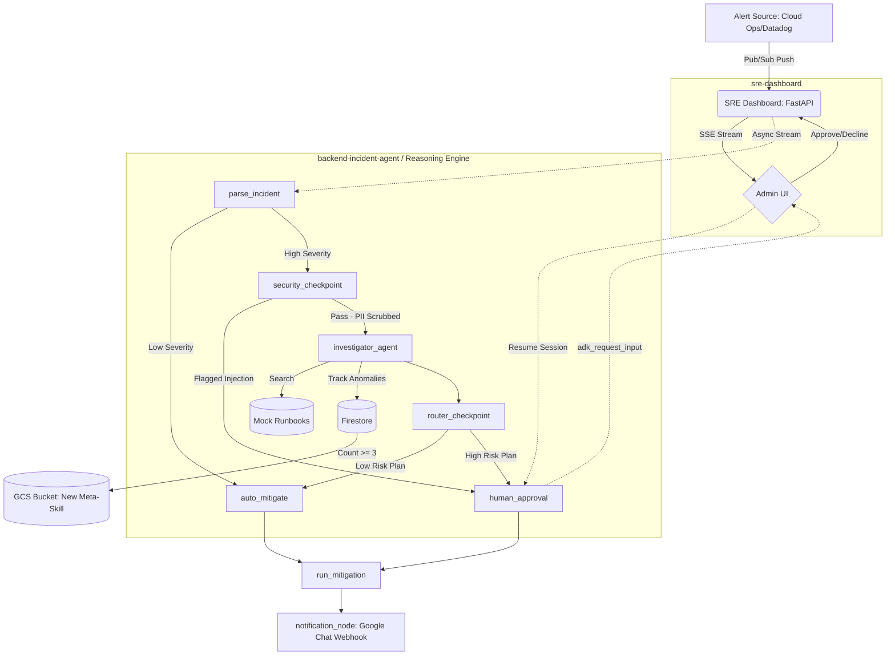

# Incident Reasoning Engine

**An SRE AI Autopilot for Automated Incident Triage & Resolution**
## 1. Project Overview & Key Features

This project demonstrates an **Automated Incident Management and Resolution pipeline** leveraging Google's Agent Development Kit (ADK) and GCP Reasoning Engines. It acts as an intelligent layer between alerting systems (like Google Cloud Operations or Datadog) and SRE teams, automating the initial triage, investigation, and mitigation planning while keeping a human firmly in the loop.

### Key Features
*   **Intelligent Alert Ingestion**: Parses JSON or text alerts from Pub/Sub push subscriptions.
*   **Automated Triage & Routing**: Classifies incident severity and routes low-priority issues differently than high-severity outages.
*   **Security First (PII & Prompt Injection)**: Automatically scrubs sensitive data (SSNs, Credit Cards, Emails, Credentials) from error logs using Regex. Defends against malicious logs (prompt injection) using a secondary lightweight LLM classifier (`gemini-3.1-flash-lite`).
*   **Runbook Lookups**: Automatically searches internal SRE runbooks based on the failing service (e.g., Database, Auth).
*   **Adaptive Meta-Skills (Learning)**: Tracks recurring anomalies in Firestore. If an incident repeats 3 times, the agent dynamically generates a new runbook (Meta-Skill) and stores it in Google Cloud Storage for future automated use.
*   **Human-in-the-Loop (HITL) Dashboard**: A real-time FastAPI dashboard allowing SREs to review the agent's investigation, see redacted types, read the compliance review, and Approve or Reject the mitigation.
*   **Google Chat Integration**: Broadcasts final decisions and incident updates to the SRE team via Google Chat Webhooks.

---

## 2. Why We Built This

Modern SRE teams face massive alert fatigue and spend critical minutes during outages just gathering context, scrubbing logs, and finding the right runbooks. We built this project to:
1.  **Reduce Toil**: Automate the repetitive tasks of log sanitization and runbook discovery.
2.  **Ensure Safety**: AI can't always be trusted to take down production databases. Our architecture uses a strict HITL checkpoint where the agent *must* pause execution and request human input (`adk_request_input`) before executing high-risk mitigation scripts.
3.  **Learn Dynamically**: We wanted the system to get smarter over time by recognizing repeating unknown issues and drafting its own meta-skills for the team to review.

---

## 3. Architecture & Project Structure



The system is split into a robust backend agent and a sleek frontend control plane:

*   **`backend-incident-agent/` (Reasoning Engine):** Built with Python and the Google Agent Development Kit (ADK). It defines a Graph Workflow (`Workflow`, `LlmAgent`, `App`) that handles state management. Deployed securely to GCP Vertex AI Reasoning Engines.
    ```text
    backend-incident-agent/
    ├── app/         # Core agent code
    │   ├── agent.py               # Main agent logic
    │   ├── agent_runtime_app.py    # Agent Runtime application logic
    │   └── app_utils/             # App utilities and helpers
    ├── tests/                     # Unit, integration, and load tests
    ├── GEMINI.md                  # AI-assisted development guide
    └── pyproject.toml             # Project dependencies
    ```
    > 💡 **Tip:** Use [Gemini CLI](https://github.com/google-gemini/gemini-cli) for AI-assisted development - project context is pre-configured in `GEMINI.md`.

*   **`sre-dashboard/` (Frontend):** A FastAPI application running on Uvicorn. It exposes a UI powered by HTML/JS that connects to the backend via Server-Sent Events (SSE). It acts as the orchestrator for the `VertexAiSessionService`.

*   **Data & Storage:** 
    *   **Firestore**: Tracks anomaly counts for the Meta-Skills system and handles mock sessions for local testing.
    *   **Google Cloud Storage (GCS)**: Stores the dynamically generated Markdown runbooks.
*   **Event Driven:** Ingestion happens via POST to `/api/trigger/pubsub`, which proxies requests down to the Reasoning Engine using asynchronous streaming execution (`stream_query_reasoning_engine`).

---

## 4. Quick Start & Usage

### Prerequisites
Before you begin, ensure you have:
*   **uv**: Python package manager - [Install](https://docs.astral.sh/uv/getting-started/installation/)
*   **agents-cli**: Agents CLI - Install with `uv tool install google-agents-cli`
*   **Google Cloud SDK**: For GCP services - [Install](https://cloud.google.com/sdk/docs/install)

### Setup & Running

**Backend Agent**
```bash
cd backend-incident-agent
uv sync
uv run pytest tests/  # Run all 11 unit/integration tests
agents-cli playground # Test the agent logic locally
```

**SRE Dashboard**
```bash
cd sre-dashboard
uv sync
# Ensure you have AGENT_RUNTIME_ID exported in your env for cloud connectivity
uvicorn main:app --host 0.0.0.0 --port 8001
```

**Triggering an Incident (Dry Run)**
You can simulate a Pub/Sub alert locally to test the flow:
```bash
curl -s -X POST http://127.0.0.1:8001/api/trigger/pubsub \
  -H "Content-Type: application/json" \
  -d '{"service": "auth-service", "severity": "HIGH", "alert_name": "OOMKiller", "error_log": "Memory usage exceeded 95%"}'
```

---

## 5. UI Features

The FastAPI Dashboard (`http://127.0.0.1:8001/`) provides a clean SRE interface:
*   **Real-time Queue**: Uses Server-Sent Events (`/api/stream/pending`) to update the UI instantly when the agent requests human approval without needing browser refreshes.
*   **Contextual Views**: Displays the Service name, Severity, exact Data Redacted, and the full Compliance Review generated by the agent.
*   **Action Controls**: One-click "Approve" or "Decline" buttons that resolve the `adk_request_input` pause and resume the agent's workflow.

---

## 6. Technical Highlights

*   **Robust JSON Fallbacks**: The Pub/Sub ingress endpoint gracefully handles unescaped quotes and falls back to plain-text payload parsing to ensure alerts are never dropped.
*   **LLM as a Judge**: Uses `gemini-3.1-flash-lite` in the `security_checkpoint` node specifically to classify raw logs for malicious prompt injection attempts before the main reasoning engine processes them.
*   **Distributed Async Tracing**: Utilizes `asyncio.run_in_executor` to prevent the Reasoning Engine stream from blocking the FastAPI event loop.

---

## 7. Performance and Evaluation

*   **Automated Testing Suite**: The project boasts 11 comprehensive tests in `pytest`. This includes integration tests for the streaming query API, tests verifying PII scrubbing (ensuring SSNs and Credit Cards are caught), prompt injection flagging, and tests that mock Google Cloud Storage to verify the local fallback logic for meta-skill creation.
*   **Low Latency Triage**: The initial severity routing and regex scrubbing take milliseconds, meaning SREs are paged instantly for high-severity issues, while the LLM takes a few extra seconds in the background to draft the mitigation plan.

---

## 8. Future Enhancements

*   **Advanced Data Loss Prevention (DLP)**: Swap our Regex-based PII scrubber for the official Google Cloud DLP API to catch more complex edge cases across different locales.
*   **Cloud Run Deployment**: Containerize the `sre-dashboard` using Docker and deploy it to Google Cloud Run for high availability.
*   **Telemetry Integration**: Connect the agent to live Datadog or Prometheus APIs so it can query current CPU/Memory metrics rather than just relying on the static error log provided in the alert.

---

## Appendix: ADK Agent Commands & Management

The following commands are available for managing the backend agent located in `backend-incident-agent/`.

### Commands

| Command              | Description                                                                                 |
| -------------------- | ------------------------------------------------------------------------------------------- |
| `agents-cli install` | Install dependencies using uv                                                         |
| `agents-cli playground` | Launch local development environment                                                  |
| `agents-cli lint`    | Run code quality checks                                                               |
| `agents-cli eval`    | Evaluate agent behavior (generate, grade, analyze, and more — see `agents-cli eval --help`) |
| `uv run pytest tests/unit tests/integration` | Run unit and integration tests                                                        |
| `agents-cli deploy`  | Deploy agent to Agent Runtime                                                                |
| `agents-cli publish gemini-enterprise` | Register deployed agent to Gemini Enterprise                    |

### 🛠️ Project Management

| Command | What It Does |
|---------|--------------|
| `agents-cli scaffold enhance` | Add CI/CD pipelines and Terraform infrastructure |
| `agents-cli infra cicd` | One-command setup of entire CI/CD pipeline + infrastructure |
| `agents-cli scaffold upgrade` | Auto-upgrade to latest version while preserving customizations |

### Development & Deployment Notes
- **Development**: Edit your agent logic in `app/agent.py` and test with `agents-cli playground` - it auto-reloads on save.
- **Deployment**:
  ```bash
  gcloud config set project <your-project-id>
  agents-cli deploy
  ```
  To add CI/CD and Terraform, run `agents-cli scaffold enhance`.
  To set up your production infrastructure, run `agents-cli infra cicd`.
- **Observability**: Built-in telemetry exports to Cloud Trace, BigQuery, and Cloud Logging.
